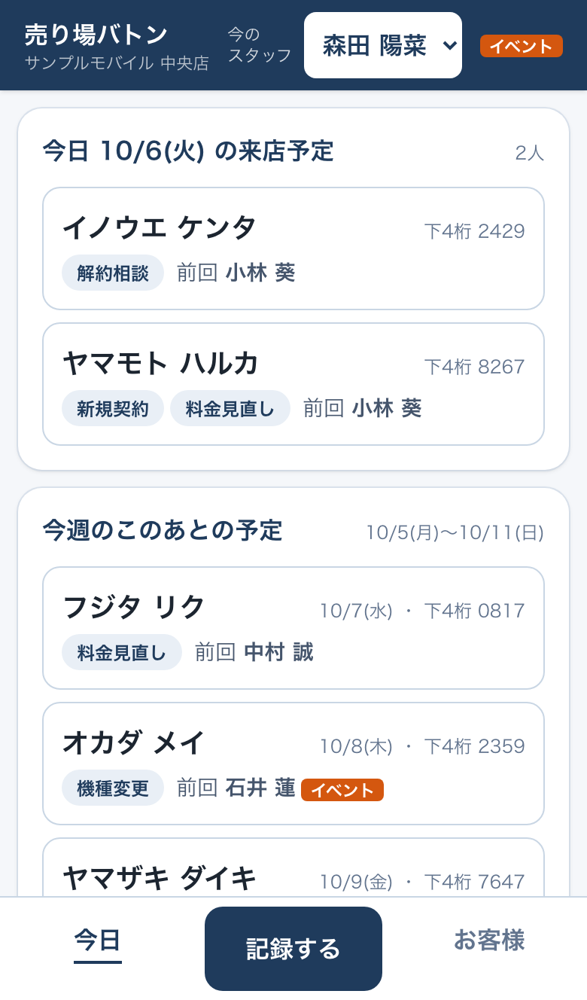
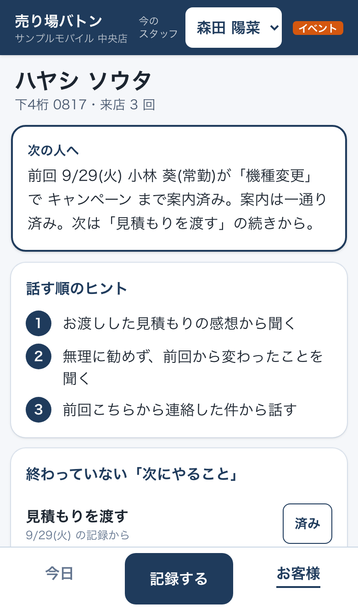
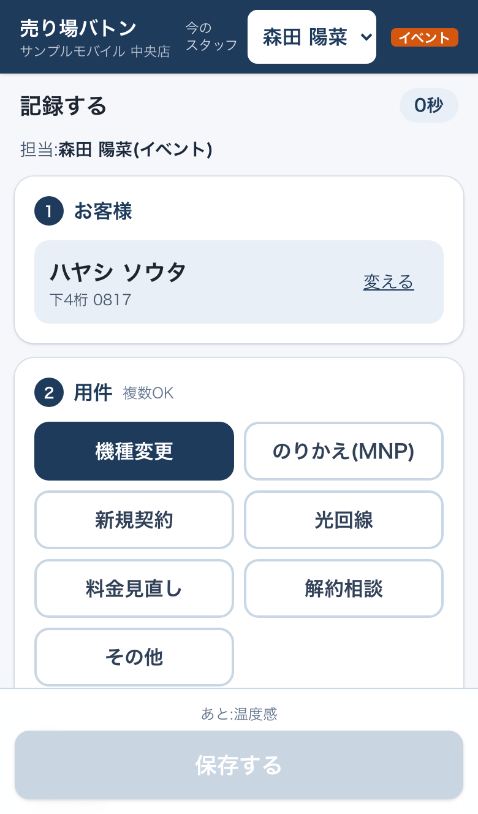

# 売り場バトン

**携帯売り場の接客を、短い記録で次のスタッフへ引き継ぐWebアプリ。**

- ヒアリングの相手は**制作者本人**(携帯売り場で14年働いている)。自分の売り場の困りごとから作った
- **「30秒以内」は目標。現場の人での計測はまだしていない**。入力秒数を記録する仕組みは入れたので、次は実際に使ってもらって測る
- いまは**ローカルで動く見本**。ログイン認証はまだ無い。現場で試す前に Supabase Auth と店舗単位の認可を入れる(下の「今後の改善」)

**本作品の分担**:業務の判断と仕様=制作者/実装の大部分=Claude Code/確かめ=テストと、別のAIによる面接官役の審査(経過は [04_AIとの作業記録](docs/04_AIとの作業記録.md))

**制作者の学習の経過**

- 2020年から HTML/CSS・Ruby・Python を独学(休止期間あり)。2025年10月から本格的に再開
- 2020年、Qiita にブラックジャックのプログラムを投稿(AIは使わずに書いた)
- paiza スキルチェック Bランク(Python)
- 2026年9月 AWS Certified Cloud Practitioner 取得

| 今日の一覧 | お客様カード | 記録する |
|---|---|---|
|  |  |  |

※ 画面はすべて見本データ(架空の店・架空の人)。スマホ幅(390px)で撮影。お客様カードの全体は [customer-card-full.png](docs/images/customer-card-full.png)

## この作品の流れ

| 段階 | やったこと | 文書 |
|---|---|---|
| 1. ヒアリング | 制作者本人(携帯売り場14年)に4つの問いで聞き、答えを原文で残した | [01_ヒアリング](docs/01_ヒアリング.md) |
| 2. 要件 | 困りごと・やること/やらないこと・完成の基準 | [02_要件](docs/02_要件.md) |
| 3. DB設計 | 正規化した9テーブル・ER図・制約の理由・迷った所 | [03_DB設計](docs/03_DB設計.md) |
| 4. 実装 | Next.js + TypeScript + Prisma + Supabase。AIとの分担と直した所 | [04_AIとの作業記録](docs/04_AIとの作業記録.md) |
| 5. テスト | 単体97本・DB統合26本・画面4本・CI | [05_テストと確かめ](docs/05_テストと確かめ.md) |
| 6. 改善 | 面接官役の審査(3周)の指摘を直し、業務の判断は制作者に聞いて反映した(04「現場の判断」)。2件は制作者が自分で直す課題として残した | [06_自分で直す課題](docs/06_自分で直す課題.md)・下の「今後の改善」 |

## 困りごと

ヒアリングで返ってきた言葉(原文):

> お客様が前回だれに何を聞いたか分からない、週末イベントスタッフが案内していて、さっくりした内容しか案内していない上に誰が案内しているかわからないことがある、最初から説明をしないといけない

記録は紙のメモ。一番困るのは、臨機応変が苦手なスタッフ。欲しいのは「時間をほぼ取らない引き継ぎツール」。

## 作ったもの

- **短く残せる記録(目標30秒)**:お客様 → 用件 → 案内したこと → 温度感 → 次にやること → 次回来店予定。全部タップ。担当者は画面上部の「今のスタッフ」から自動で入る
- **入力秒数の記録**:最初の入力から保存までの秒数を毎回保存(画面を開いたまま接客する時間は混ぜない。測れなかった記録は集計に入れない)。平均と「30秒以内の割合」を、常勤・イベントスタッフに分けて出す。見本データ・自動テストの秒数は実測に混ぜず、見本値は「参考」と書いて分ける
- **二重送信の防止**:保存を2回押しても、通信が切れて送り直しても、記録は1件。同じ送信で中身が違えば断る
- **担当者の取り違え防止**:画面に出ている担当者と、保存する人が違えば保存しない
- **お客様カード**:名前カナか電話番号の下4桁で探す。一番上に
  「前回 10/3(土) 森田 陽菜(イベント)が「のりかえ(MNP)」で 料金比較・端末価格 まで案内。次は 下取り・キャンペーン から。説明済み:料金比較・端末価格 はまず理解度を伺い、必要ならもう一度詳しく。」
  その下に「話す順のヒント」3つ、「案内の状況」(説明済み・前回あいまい・変更あり・まだ)、過去の記録
- **現場の判断どおりの引き継ぎ**:まだ渡していない見積もりは「作りながら案内」、前々回の未完了の約束は担当者に確認してから、説明済みは期限で切らず理解度を伺う、料金・キャンペーンが変わっていたら必ず案内(04 に制作者の答えを原文で)
- **今日の一覧**:今日・今週の来店予定と、終わっていない「次にやること」
- **イベントスタッフの印**:誰が案内した記録か一目で分かる

要約とヒントはAIを使わず、決まったルールで組み立てている(同じ記録なら毎回同じ文になり、理由を説明できる)。

## 技術

| 分野 | 使ったもの |
|---|---|
| 画面 | Next.js 16(App Router・Server Actions)・React 19・TypeScript(strict)・Tailwind CSS 4 |
| DB | PostgreSQL 17(Supabase をローカルで起動)・Prisma 7 |
| テスト | Vitest(単体・DB統合)・Playwright(スマホ画面の通しテスト) |
| CI | GitHub Actions(lint・型チェック・テスト・build、PostgreSQL を立てて統合テストと画面テスト) |
| 開発 | Claude Code |

## DB設計

用件を配列でなく中間表にした理由、電話番号を下4桁だけにした理由、選んでいない用件の項目にチェックがつくのを組の外部キーでDBが止める仕組み、などは **[docs/03_DB設計.md](docs/03_DB設計.md)** にER図と一緒にまとめた。

```
stores ─┬─ staff ─────────────┐
        └─ customers ─ visits ┴─┬─ visit_topics ─ visit_checks
                                └─ next_actions
topics ─ checklist_items(用件と案内項目の目録)
```

## 動かし方

必要なもの:Node.js 20.19 以上(24 で確認)・Docker Desktop・Supabase CLI

```bash
npm install
cp .env.example .env          # ローカルの Supabase の既定値が入っている
supabase start                # Docker 上で Postgres などが立ち上がる
npm run db:generate           # Prisma のクライアントを作る
npm run db:deploy             # テーブルを作る
npm run db:seed               # 見本データ(作り物)を入れる
npm run dev                   # http://localhost:3000
```

`npm run db:seed` は接続先が localhost のときだけ動く(本番などのDBを消さないため)。

スマホの大きさで見るときは、ブラウザの開発者ツールでスマホ表示にする。最初に画面上部で「今のスタッフ」を選ぶ。

見本データは架空の店「サンプルモバイル 中央店」、スタッフ5人(常勤3・イベント2)、お客様20人、記録53件(理解があいまいの印・前々回の未完了の約束・キャンペーンの改定も少し入れてある)。店名・人名はすべて作り物。`npm run db:seed` は流すたびに中身を入れ直す。

### テスト

```bash
npm test             # 単体テスト(DBなし)
npm run test:db      # DB統合テスト(supabase start と seed が先)
npm run test:e2e     # 画面の通しテスト(同上。build して起動まで自動)
npm run screenshots  # README のスクショを撮り直す(先に db:seed で見本に戻す)
npm run lint && npm run typecheck && npm run build
```

## 今後の改善

1. **ログインと店舗単位の認可(現場で試す前に必須)**:Supabase Auth でスタッフごとにログインし、「今のスタッフ」を置き換える。いまの RLS は「Supabase の API から直接読めない」ことだけを守っていて、アプリのサーバーから先は誰でも全部読める。ログインした人の店だけを読む・書く確認を入れる
2. **売り場で使ってもらう**:入力秒数の実測の平均と「30秒以内の割合」を見て、時間がかかっている段を減らす。特にイベントスタッフの数字を見る
3. **自分で直す課題2つ**:予定日を空欄にした記録で前の来店予定が消える件・「済み」ボタンの担当者の照合。制作者が自分で直す([06](docs/06_自分で直す課題.md))
4. **重複したお客様をまとめる**:同じ瞬間の新規登録は二重になりうる(05 に書いた)
5. **記録の修正**:履歴を残す形で
6. **公開**:Vercel と Supabase(本番)へ。持ち主の確認のあと
