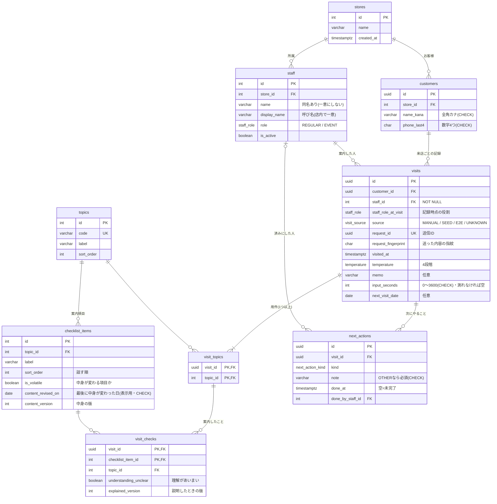

# 03 DB設計

データベースは PostgreSQL(ローカルでは Supabase の Postgres 17)。読み書きは Prisma 7 から行う。
スキーマ: [`prisma/schema.prisma`](../prisma/schema.prisma) / 実際に流すSQL: [`prisma/migrations/`](../prisma/migrations/)

## ER図

## 各テーブルの役割

| テーブル | 役割 | 主なルール |
|---|---|---|
| `stores` | 店 | この版は1店だけ。でも全部の表が店にぶら下がるので、複数店に広げやすい |
| `staff` | スタッフ | 役割(常勤/イベント)を enum で持つ。辞めた人は消さずに `is_active=false`(過去の記録の「誰が」を残すため) |
| `customers` | お客様 | 名前カナと電話番号の**下4桁だけ**。店ごとに持つ |
| `visits` | 接客記録(来店1回=1件) | 担当者 `staff_id` は NOT NULL。記録時点の役割・出どころ(人/見本/自動テスト)・送信ID・入力にかかった秒数・次回来店予定日を持つ |
| `topics` | 用件の目録(機種変更・のりかえ…) | 画面のボタンはこの表から作る |
| `checklist_items` | 用件ごとの「案内すること」の目録 | `sort_order` が話す順。要約の「次は〜から」はこの順で出す。料金・キャンペーンなど中身が変わる項目は、最後に中身が変わった日を持つ |
| `visit_topics` | 記録 × 用件の中間表 | 1回の来店で用件は複数 |
| `visit_checks` | 記録 × 案内項目の中間表 | 選んだ用件の項目しか入らない(下の「迷った所 3」)。お客様の理解があいまいだったかの印を持つ |
| `next_actions` | 次にやること | `done_at` が空なら未完了。済みにした人も残す |

## 制約と、その理由

| 種類 | どこに | 理由 |
|---|---|---|
| 主キー | マスタ(店・スタッフ・目録)は連番、記録系(お客様・記録・次にやること)は UUID | 記録系の id は URL に出る。連番だと「次の番号」を打てば他のお客様が見えてしまうので、推測しにくい UUID にした |
| 外部キー | すべての親子 | 「存在しないお客様の記録」を作らせない |
| 削除時の動き | お客様を消すと記録・用件・チェック・次にやることも消える(CASCADE)。スタッフ・用件の目録は、使われていたら消せない(RESTRICT) | お客様の削除依頼にはまとめて応えられるように。スタッフや目録を消すと過去の記録が読めなくなるので止める |
| NOT NULL | `visits.staff_id`・`temperature`・`visit_checks.explained_version` など | 「誰が案内したか必ず残る」を、画面だけでなくDBでも守る。`input_seconds` はわざと空を許す(下の「迷った所 11」) |
| enum | 役割・温度感・次にやることの種類・記録の出どころ | 値の種類が少なく、増えるときは画面の変更も要るものだけ。打ち間違いの値が入らない |
| CHECK | `phone_last4 ~ '^[0-9]{4}$'` | 下4桁以外(全桁・ハイフン入り)を入れさせない |
| CHECK | `name_kana ~ '^[ァ-ヶー ]+$'` | 画面で揃え忘れても、ひらがな・漢字が混ざらない(混ざると検索で見つからなくなる) |
| CHECK | `input_seconds BETWEEN 0 AND 3600` | 画面を開きっぱなしにした異常値で平均が壊れないように |
| CHECK | `kind <> 'OTHER' OR note が空でない` | 「その他」だけでは次の人に何も伝わらない |
| CHECK | `content_revised_on` は `is_volatile` の項目にだけ入る | 中身が変わらない項目に改定日が入って「変更あり」が出るのを防ぐ |
| CHECK | `done_at` と `done_by_staff_id` はそろって入るか、そろって空 | 「済み」なのに誰が済ませたか分からない、を防ぐ |
| 一意 | `visits(request_id)` | 同じ送信IDの記録は1件しか入らない(二重送信の防止。下の「迷った所 8」) |
| 一意 | `topics(code)`・`checklist_items(topic_id, label)` | 同じ名前のボタンが2つ並ばないように |
| (一意にしない) | `staff(store_id, name)` | 同じ名前のスタッフはありうる(最初は一意にしていたが、2周目の審査で外した) |
| 一意 | `staff(store_id, display_name)` | 画面に出す「呼び名」は店内で重ならない。選択欄・担当表示・履歴・「◯◯さんに確認」はすべて呼び名を使う(下の「迷った所 13」) |
| RLS(行レベルセキュリティ) | 全テーブル | Supabase は public の表を API から読めるようにしている。このアプリはサーバー側の Prisma からしか触らないので、RLS を有効にしてポリシーを作らないことで、API からの直接の読み書きを全部止めた(公開キーで `/rest/v1/customers` を読むと空の配列が返ることを確かめた) |

CHECK 制約と RLS は Prisma のスキーマでは書けないので、[最初のマイグレーション](../prisma/migrations/20261006114703_init/migration.sql)の末尾に手で足している。

## インデックス

| インデックス | 使う場面 |
|---|---|
| `customers(store_id, phone_last4, name_kana)` | 「下4桁で探す」「下4桁+カナで探す」。下4桁は1万通りあるので、まずこれで絞るのが一番速い |
| `customers(store_id, name_kana varchar_pattern_ops)` | 「カナだけで探す」(前方一致 `LIKE 'カト%'`) |
| `visits(customer_id, visited_at DESC)` | お客様カードの時系列(新しい順) |
| `visits(next_visit_date)` | 今日・今週の来店予定 |
| `next_actions(done_at)` | 終わっていない「次にやること」 |

お客様を2万人に増やして(トランザクションの中で入れて、最後に取り消し)実行計画を確かめた。

- 下4桁で探す:`customers_store_id_phone_last4_name_kana_idx` を使い 0.01ms
- カナだけで探す:最初は普通の索引で、**全件読み(Seq Scan)になった**。PostgreSQL は文字の並び順の規則(照合順序)によって、普通の索引を `LIKE` の前方一致に使えないため。`varchar_pattern_ops` を付けて作り直したら索引を使うようになった(0.45ms)

## 設計で迷った所と、選んだ理由

### 1. 用件を「配列の列」でなく「中間表」にした

`visits.topics text[]` のように配列で持つと表は1つ減る。でも、

- 「のりかえの相談が今月何件あったか」を数えるのに、配列の中を開いて数える必要がある
- 用件の名前を変えたとき、過去の記録の配列を全部書き換えることになる
- 配列の中身には外部キーが張れないので、目録にない用件が入っても気づけない

中間表 `visit_topics` なら、用件の目録 `topics` への外部キーで守れて、集計も普通の JOIN で書ける。

### 2. 電話番号は下4桁だけにした

引き継ぎで必要なのは「この前の人と同じ人か」が分かることだけ。名前カナと下4桁がそろえば、売り場の規模ならほぼ見分けられる。全桁を持つと、漏れたときの被害が大きくなる。**個人情報は使う分だけ持つ**ことにした。

下4桁がたまたま同じ人はいる(seed でもわざと2人作っている)。その場合はカナで見分ける。`customers` に一意制約を付けなかったのも同じ理由(同姓同名で下4桁も同じ人がいないとは言い切れない)。

### 3. 「選んでいない用件の項目にチェックがつく」をDBで止めた

素直に作ると `visit_checks(visit_id, checklist_item_id)` の2列になる。これだと、用件「光回線」を選んでいない記録に「工事日」のチェックが入っても、DBは止めない。

そこで `visit_checks` に `topic_id` も持たせ、外部キーを2本の組で張った。

- `(visit_id, topic_id)` → `visit_topics`:その記録で選んだ用件か
- `(checklist_item_id, topic_id)` → `checklist_items(id, topic_id)`:その項目は本当にその用件の項目か

`topic_id` を重ねて持つのは正規化の考え方からは少し外れる。でも、この組の外部キーがあることで、矛盾したデータがそもそも入らない。画面とサーバーでも同じ確認をしているが、DBが最後の砦になる。統合テストで、矛盾したチェックが入らないことを確かめている。

### 4. 「イベントスタッフの印」は、記録した時点の役割を記録に写して持つ

最初は、同じ事実を2か所に持たないよう `staff.role` を JOIN して印を出していた。面接官役の審査で「イベントスタッフが後で常勤になると、過去の記録の印も、イベントスタッフの入力秒数の集計も変わってしまう」と指摘された。

「記録した時点でイベントスタッフだった」は、後から変わってはいけない**その時の事実**なので、`visits.staff_role_at_visit` に写して持つことにした(今の役割は `staff.role`、記録時点の役割は `visits.staff_role_at_visit`。別の事実なので重複ではない)。印・集計・要約はすべて記録時点の役割を使う。役割を変えても過去の集計が変わらないことを統合テストで確かめている。

この列を足す前の記録は、足した時点のスタッフの役割で埋めた(それより前の変化は分からないため)。

### 5. 「次にやること」は文字でなく種類(enum)+自由記入

「見積もりを渡す」を文字で持つと、話す順のヒント(「お渡しした見積もりの感想から聞く」)をルールで作れない。種類を enum で持ち、当てはまらないものだけ「その他+自由記入」にした。

### 6. 済みにするのは「条件つき更新」

2人が同じ「次にやること」を同時に「済み」にしても、記録されるのは先の1人だけにした。`UPDATE ... WHERE id = ? AND done_at IS NULL` の形で更新し、0件なら「もう誰かが済みにしている」と分かる。後から押した人が上書きしないので、「誰が済ませたか」が正しく残る。統合テストで、2つ同時に投げて1つだけ通ることを確かめている。

### 7. 日付は「日本時間の今日」で決める

`next_visit_date` は時刻のない DATE 型。サーバーがどのタイムゾーンで動いても同じになるよう、「今日」「今週(月〜日)」はアプリ側で日本時間に直して決めている。大みそか・年をまたぐ週は、単体テストと統合テストの両方で確かめている。

### 8. 二重送信は「送信ID」で1件にまとめる

保存を2回押した、電波が切れて送り直した、で同じ記録が2件できると、来店回数も集計も狂う。記録画面を開いたときに画面が送信ID(UUID)を1つ作り、記録と一緒に保存する。`visits.request_id` には一意制約を付けた。

- 同じIDがもう保存されていて、**中身も同じ**なら、新しく作らずに保存済みの1件を返す
- 同じIDで**中身が違えば**断る(「内容が変わっています。新しい記録として保存し直してください」)。画面は次の保存から新しい送信IDを使う。以前は黙って古い記録を返していて、直した中身が捨てられていた(2周目の審査で指摘)
- 中身が同じかは `visits.request_fingerprint`(送った内容を並べ直してから取った SHA-256)で比べる。入力秒数は押すたびに変わるので指紋に入れない
- 2つが同時に届いたら、後の方はDBの一意制約で失敗する。そこで保存済みの1件を探し直して返す。新規のお客様の作成も同じトランザクションなので、お客様も二重にならない

統合テストで、順番に2回・同時に2回の両方を確かめている。

### 9. 見本の秒数と、人が入れた秒数を分ける

見本データ(seed)の入力秒数は作り物。これを実測と一緒に平均すると、「30秒以内で残せている」ように見えてしまう(面接官役の審査での指摘)。`visits.source` に出どころ(MANUAL=人が画面で入れた/SEED=見本/E2E=自動テスト/UNKNOWN=出どころ不明)を持たせ、画面の「記録にかかった時間」は MANUAL だけで集計する。

**旧版のDBから上げたときの既存の記録は UNKNOWN にした。** 最初の版では MANUAL にしていたため、見本しか入っていない旧版のDBを上げると、見本が全部「人の実測」になっていた(2周目の審査で指摘)。SEED 扱いにする案もあったが、旧版のDBに人が入れた記録が無いとは言い切れない。分からないものは分からないと残すのが正直なので UNKNOWN にし、どちらの集計にも入れない。このマイグレーションはまだ公開していなかったので、新しいマイグレーションを足すのではなく、そのものを直した(足す形だと、旧版のDBは一度 MANUAL を通ってしまい、あとから見分けられない)。旧版の見本入りDBから上げる移行テストがある。見本の秒数は「見本値(参考)」と書いて別に出す。実測が0件のあいだは「まだ実測なし」と出す。

### 10. 「説明済み」を期限でなく、理解度と中身の改定で決める(現場の判断。04)

日数で「説明済み」を切ると、1年前の説明も昨日の説明も同じに扱えない一方、「何日なら古いか」に根拠がない。制作者(現場)の答えは「期限ではなく、お客様の理解度を伺う。料金プランやキャンペーンが変わっていたら必ず案内する」だった。そこで、データとして持つのは次の2つにした。

- **`visit_checks.understanding_unclear`**:案内したその場で「理解があいまい」と感じたら付ける印。案内したことの中間表の1行(=その日のその項目の案内)についての事実なので、ここに持つ。既定は false(付けない)で、記録画面では任意のタップ1回。あとの来店で同じ項目をあいまいの印なしで案内したら、説明済みに戻る
- **`checklist_items.is_volatile` と `content_version`**:料金・キャンペーンのように中身が変わる項目か、と、今の中身の版(中身が変わるたびに1つ上げる)。`content_revised_on`(最後に変わった日)は表示用に残している
- **`visit_checks.explained_version`**:説明したときの、その項目の版。**記録画面に出ていた版**を画面から一緒に送ってもらい、それを残す。保存するときに今の版と違えば(画面を開いたあとに改定された)、「◯◯の中身が変わりました。もう一度確認してから保存してください」と返して保存しない。最初は保存するときのDBの今の版を写していたが、それだと古い中身を説明したのに新しい版を説明したことになってしまう(3周目の審査で指摘)
- 判定:中身が変わる項目で、**説明した版 ≠ 今の版** なら「変更あり:必ず案内」。説明済みには数えない

#### 日付の比較をやめて、版で比べるようにした理由

最初は「最後に説明した日 ≦ 改定日 なら変更あり」と日付で比べていた。これだと、改定した**当日**に説明した記録は、改定の前に説明したのか後に説明したのか分からない(当日は必ず案内する方に倒していたので、改定後の新しい中身を説明した人の記録まで「変更あり」になっていた。2周目の審査で指摘)。説明したときに「どの版を説明したか」を残せば、日付に関係なく正しく決まる。同じ日に2回改定しても版は2つ上がるので区別できる。

版の列を足す前の記録は、来店日で推し量って埋めた(改定日の当日以前なら古い版、後なら今の版。当日は古い版=必ず案内し直す側に倒した)。推し量りはこの1回だけで、これから入る記録は版をそのまま残す。

改定の**履歴の表**(いつ・何が変わったか)を作る案もあった。今の判断に要るのは「説明した版と今の版が同じか」だけなので、列で足りる。「何が変わったか」を画面に出したくなったら、`checklist_item_revisions(item_id, version, revised_on, note)` に分ける。

### 11. 入力秒数は「最初の入力から」

画面を開いた時から数えると、接客中に画面を開いておいた時間(数分)が混ざる。**入力の値が最初に変わった時**から保存までを入力時間にした。タップでもキーボードだけの操作でも同じ所(値の変化)で拾う。

一度も入力しないまま保存された場合など、測れなかったときは **0秒にせず空(NULL)** で残し、集計に入れない。0秒で残すと平均が実際より速く見えるため。`input_seconds` が NOT NULL でないのはこのため。

### 12. 画面に出ていた担当者と、保存する人を突き合わせる

「今のスタッフ」はブラウザの Cookie に覚えている。別のタブで担当者を切り替えると、記録画面には前の人の名前が出たまま、保存は新しい人の名前で残ってしまう(2周目の審査で指摘)。記録画面は、画面に出している担当者の ID を一緒に送る。保存するときの「今のスタッフ」と違えば保存せず、「担当者が切り替わっています。画面上部で担当者を選び直してから保存してください」と返す(統合テスト・画面テストあり)。

### 13. 同じ名前のスタッフは「呼び名」で見分ける

名前の一意制約を外したあと、最初は同じ名前の人を「ID の末尾2桁」で見分けていた。これは 104 と 204 のように重なる(3周目の審査で指摘)。ID を全部出す案は、売り場の人に意味のない数字を覚えさせることになる。

そこで `staff.display_name`(呼び名)を足し、**店内で一意**にした。売り場では「佐藤さん(早番)」「光さん」のように、もともと呼び分けている名前がある。それをそのまま入れてもらう想定。名前(`name`)は正式な名前として残し、画面に出すのはすべて呼び名にそろえた(選択欄・担当表示・履歴・済みにした人・「◯◯さんに確認」)。

呼び名を足す前のスタッフは、名前をそのまま呼び名にした。同じ店に同じ名前が2人いたら、2人目からは「名前-ID」にして重ならないようにした(移行テストあり)。

## 店の境界:DBで守っていること・関数で守っていること

| こと | どこで守るか |
|---|---|
| お客様・スタッフはどこかの店に属する | DB(外部キー・NOT NULL) |
| 記録のスタッフと、お客様が**同じ店** | **DBでは保証していない**。`createVisit` が「スタッフもお客様もこの店か」を確かめる(統合テストあり) |
| 「次にやること」を済みにした人が、その記録と**同じ店** | **DBでは保証していない**。`completeNextAction` が「済みにする人はこの店のスタッフか」「その約束はこの店の記録か」を確かめる(統合テストあり) |
| 送信IDが別の店の記録と重なったとき | 関数で断る |

DBでも守るなら、`visits` に `store_id` を持たせて `(customer_id, store_id)` と `(staff_id, store_id)` の組で外部キーを張る形になる。いまは1店だけなので関数側の確認にとどめた。複数店に広げるときに決める(02 の「やらないこと」)。

## seed(見本データ)の安全

`npm run db:seed` は全テーブルを消してから入れ直す。本番などのDBを消さないよう、接続先が localhost / 127.0.0.1 以外なら止める。消すのと入れるのは1つのトランザクションなので、途中で失敗したら元のまま残る。

